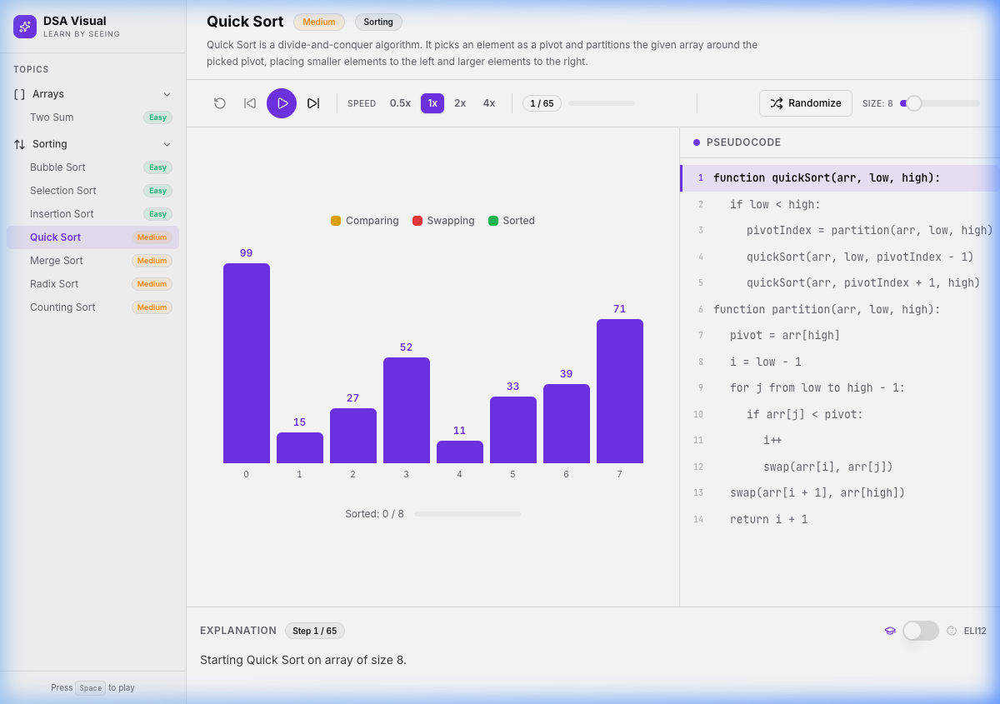
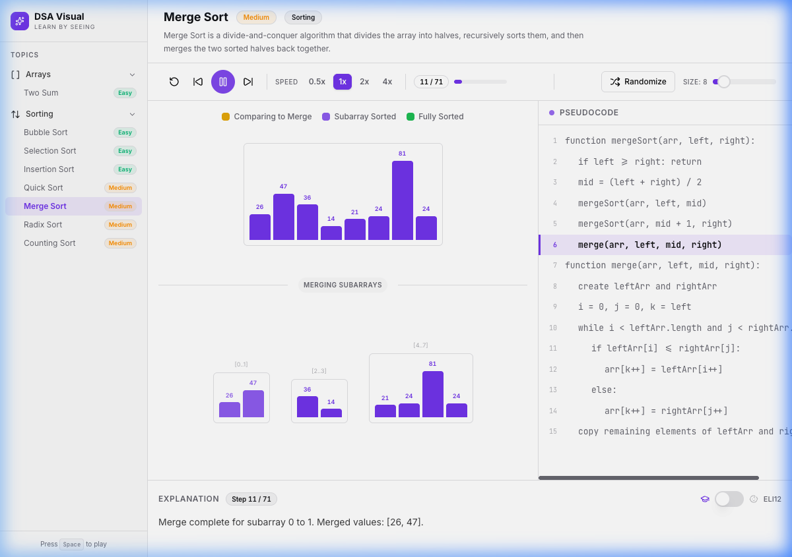
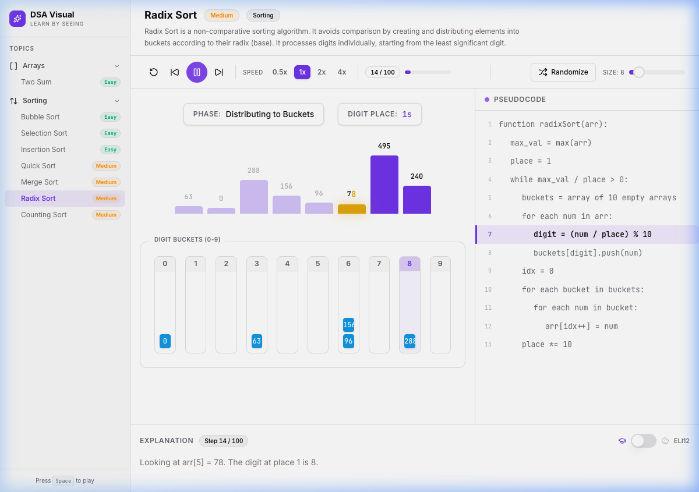
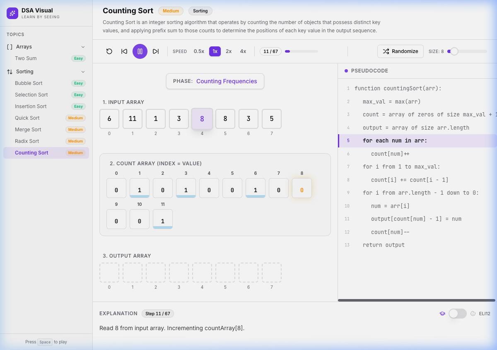

# DSA Visual — Learn Algorithms by Seeing

A visual, interactive learning platform that helps beginners understand **Data Structures & Algorithms** through step-by-step animations and beginner-friendly explanations.

> **No backend required.** All algorithm execution happens entirely in the browser.

🚀 **Live Demo:** [https://dsa-visualizer-two-pi.vercel.app/](https://dsa-visualizer-two-pi.vercel.app/)

  

---

## ✨ Features

- **Step-by-step visualization** — Every algorithm generates a sequence of states. The UI renders them one at a time so you can see exactly what happens at each step.
- **Animated visualizations** — Smooth Framer Motion animations for bar swaps, cell highlights, and HashMap entries.
- **Pseudocode tracking** — See which line of pseudocode is executing at every step.
- **"Explain Like I'm 12" mode** — Toggle beginner-friendly explanations with a single switch.
- **Playback controls** — Play, Pause, Step Forward, Step Backward, Reset, and adjustable speed (0.5x–4x).
- **Keyboard shortcuts** — `Space` (play/pause), `←` / `→` (step), `R` (reset).
- **Dark mode** — Automatic system preference detection.
- **Responsive** — Desktop sidebar, mobile hamburger drawer.

---

## 📸 Visualizers in Action

<table>
  <tr>
    <td width="50%">
      <b>Bar Visualizer (Sorting)</b><br/>
      <i>Used in Quick, Bubble, Selection, and Insertion Sort. Features dynamic markers (MIN, PIVOT).</i><br/>
      
    </td>
    <td width="50%">
      <b>Merge Sort Visualizer</b><br/>
      <i>A custom tree-based visualizer showing the array splitting into chunks and merging.</i><br/>
      
    </td>
  </tr>
  <tr>
    <td width="50%">
      <b>Radix Sort Visualizer</b><br/>
      <i>A 10-bucket system (0-9) where numbers drop down based on their place value.</i><br/>
      
    </td>
    <td width="50%">
      <b>Counting Sort Visualizer</b><br/>
      <i>A 3-part layout visualizing frequencies, prefix sums, and the final output array.</i><br/>
      
    </td>
  </tr>
</table>

---

## 🧠 Supported Algorithms

| Category | Algorithm | Difficulty | Key Visual Features |
| :--- | :--- | :--- | :--- |
| **Trees** | Pre / In / Post-order | Easy | Recursive Call Stack UI & Node Highlights |
| | Level-order Traversal | Medium | Dynamic Queue & Layer Tracking |
| **Arrays** | Two Sum | Easy | HashMap State & Dynamic Tables |
| | Stock Buy and Sell | Medium | Min/Max Dynamic Pointers |
| | Kadane's Algorithm | Medium | Contiguous Subarray Trackers |
| | Majority Element 1 & 2| Easy/Hard | Moore's Voting & Candidate Frequencies |
| **Sorting** | Bubble, Selection, Insertion | Easy | Array comparisons & swaps |
| | Quick, Merge | Medium | Divide & Conquer strategies |
| | Radix, Counting | Medium | Buckets, Frequencies, & Prefix Sums |
| **Searching** | Linear, Binary Search | Easy | Array Traversal & Elimination bounds |
| **Linked List** | Singly Linked List Search | Easy | Pointer Traversal & Object References |
| **Graphs** | BFS, DFS | Medium | Adjacency Lists, Queues, & Call Stacks |

## 🚀 Getting Started

### Prerequisites

- [Node.js](https://nodejs.org/) v18 or higher
- npm v9 or higher

### Installation

```bash
# Clone the repository
git clone https://github.com/your-username/DSA_Visualizer.git
cd DSA_Visualizer

# Install dependencies
npm install

# Start the dev server
npm run dev
```

> **Troubleshooting `npm: command not found`**
> If you get a "command not found" error, your Node manager (like `fnm` or `nvm`) might not be loaded in your terminal session.
> Try running this before your `npm` commands:
> ```bash
> export PATH="$HOME/.local/share/fnm:$PATH" && eval "$(fnm env)"
> ```

Open **http://localhost:5173** in your browser.

### Build for Production

```bash
npm run build
npm run preview
```

## 🧪 Testing & Quality Assurance

This project uses a robust QA pipeline to prevent regressions.

### Run Unit Tests
We use **Vitest** to mathematically verify the core logic of the algorithm generators.
```bash
npm run test
```

### Run Static Analysis & Type Checking
To check for ESLint warnings and TypeScript type errors:
```bash
npm run lint
npm run typecheck
```

> **Note on Committing:** 
> We use **Husky** and **lint-staged**. Whenever you run `git commit`, it will automatically run the linters and type checkers on your staged files. If there are any errors (like unused variables or type mismatches), the commit will be aborted to keep the `main` branch clean!

---

## 🏗️ Architecture

```
Algorithm Generator → VisualizationStep[] → Playback Engine → UI Components
```

The core design principle: **algorithms generate states, the UI renders states.**

- Algorithms produce a `VisualizationStep<T>[]` array containing every intermediate state.
- The generic `usePlaybackEngine<T>` hook manages playback (play/pause/step/speed).
- Visualizer components render the current state with animations.
- The engine is **fully algorithm-agnostic** — adding a new algorithm requires zero changes to the playback system.

---

## 📁 Project Structure

```
src/
├── algorithms/                 # Algorithm step generators
│   ├── bubbleSort/
│   │   ├── generator.ts        # generateBubbleSortSteps()
│   │   └── config.ts           # Pseudocode, metadata
│   └── twoSum/
│       ├── generator.ts        # generateTwoSumSteps()
│       └── config.ts           # Pseudocode, metadata
├── components/                 # Reusable UI components
│   ├── Controls/
│   │   ├── PlaybackControls.tsx # Play/pause/step/speed controls
│   │   └── InputControls.tsx    # Algorithm-specific inputs
│   ├── ExplanationPanel/
│   │   └── ExplanationPanel.tsx # Step explanation + ELI12 toggle
│   ├── PseudocodePanel/
│   │   └── PseudocodePanel.tsx  # Line-highlighted pseudocode
│   ├── Sidebar/
│   │   └── Sidebar.tsx          # Topic navigation
│   └── ui/                     # shadcn/ui primitives
├── hooks/
│   └── usePlaybackEngine.ts    # Generic playback engine
├── visualizers/                # Algorithm-specific visualizers
│   ├── BubbleSortVisualizer/
│   └── TwoSumVisualizer/
├── types/
│   └── index.ts                # All TypeScript interfaces
├── pages/
│   └── AlgorithmPage.tsx       # Main layout composition
├── lib/
│   └── utils.ts                # Utility functions
├── App.tsx                     # Root with dark mode
├── main.tsx                    # Entry point
└── index.css                   # Design system & theme
```

---

## 🛠️ Tech Stack

| Technology | Purpose |
|-----------|---------|
| [React](https://react.dev) | UI framework |
| [TypeScript](https://typescriptlang.org) | Type safety |
| [Vite](https://vite.dev) | Build tool & dev server |
| [TailwindCSS v4](https://tailwindcss.com) | Utility-first styling |
| [shadcn/ui](https://ui.shadcn.com) | UI component primitives |
| [Framer Motion](https://motion.dev) | Animations |
| [Lucide React](https://lucide.dev) | Icons |
| [Vitest](https://vitest.dev) | Automated Unit Testing |
| [Husky & Lint-Staged](https://typicode.github.io/husky/) | Pre-commit hooks & Quality Assurance |
| [GitHub Actions](https://github.com/features/actions) | CI/CD Pipeline |

---

## 🔮 Adding a New Algorithm

The architecture is designed for easy extension. To add a new algorithm:

1. **Create the generator** in `src/algorithms/<name>/generator.ts`:
   ```typescript
   function generateMyAlgorithmSteps(input): VisualizationStep<MyState>[] {
     // Generate all intermediate states
   }
   ```

2. **Create the config** in `src/algorithms/<name>/config.ts`:
   ```typescript
   export const myAlgorithmConfig: AlgorithmConfig = {
     id: "my-algorithm",
     title: "My Algorithm",
     category: "Category",
     pseudocode: [...],
     difficulty: "Easy",
   };
   ```

3. **Build the visualizer** in `src/visualizers/<Name>Visualizer/`:
   ```typescript
   function MyAlgorithmVisualizer({ state }: { state: MyState }) {
     // Render the current state with animations
   }
   ```

4. **Register it** in `AlgorithmPage.tsx` and `Sidebar.tsx`.

The playback engine, pseudocode panel, explanation panel, and controls work automatically — no changes needed.

---

## 📋 Future Roadmap

- [x] Trees (Pre-order, In-order, Post-order, Level-order)
- [ ] Linked Lists (insertion, deletion)
- [ ] Stack & Queue operations
- [ ] Binary Search Trees (insertion, deletion)
- [x] Graph traversal (BFS, DFS)
- [ ] Dynamic Programming (Fibonacci, Knapsack)
- [ ] Algorithm complexity annotations
- [ ] Shareable visualization links

---

## 📄 License

MIT
