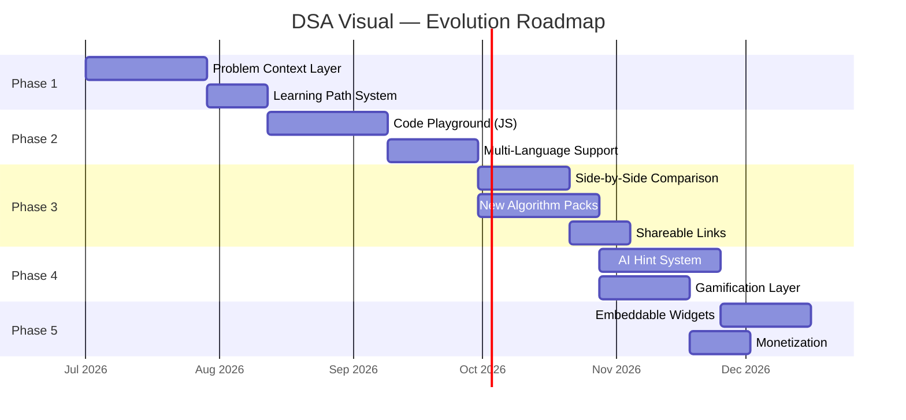

# DSA Visual — Platform Evolution Roadmap

> **Goal**: Transform DSA Visual from a "great visualizer" into the **best interactive DSA learning platform** on the web — combining visualization, education, and hands-on practice in one cohesive experience.

---

## 1. Market Research & Competitive Analysis

### 1.1 Competitive Landscape

| Platform | Strengths | Weaknesses | Our Opportunity |
| :--- | :--- | :--- | :--- |
| **VisuAlgo** (NUS) | 40+ algorithms, quiz system, academic gold standard | Dated UI, no custom code input, no mobile-first design | Premium aesthetics + modern UX blow it away |
| **Algorithm Visualizer** | Custom code input (JS/Python/C++), open-source | No educational layer, no explanations, basic UI | We already have explanations + ELI12; add code input to win |
| **Python Tutor** | Best-in-class code tracing (heap/stack), multi-language | Not algorithm-focused, no visual DS animations | Combine their tracing with our rich DS visualizations |
| **AlgoMonster** | Pattern-based learning, step-by-step control | Paid, limited free access, not open-source | Free + open-source with the same pedagogical depth |
| **USF Visualizations** | Clean, intuitive, academic | Very limited algorithms, static, no code sync | Our code sync + playback engine is already superior |
| **See Algorithms** | Embeddable, shareable URLs | Limited algorithm set, minimal educational content | We can add sharing while keeping our rich feature set |

### 1.2 What Users Actually Want (Research Findings)

Based on user research across multiple sources, here's what users prioritize, **ranked by importance**:

| Rank | Feature | User Need | Our Status |
| :--- | :--- | :--- | :--- |
| 🥇 | **Speed/Pace Control** | Pause, rewind, step, adjustable speed | ✅ **Done** (0.5x–4x, step forward/back) |
| 🥈 | **"Why" not just "What"** | Explain *why* an algorithm works, not just show data movement | ⚠️ **Partial** (ELI12 + explanations exist, but no "problem context") |
| 🥉 | **Custom Input** | Test own data, edge cases | ✅ **Done** (InputControls per algorithm) |
| 4 | **Code ↔ Visual Sync** | See pseudocode/real code highlighted alongside animation | ✅ **Done** (multi-language code panel) |
| 5 | **Bring Your Own Code** | Paste code → watch it execute with visualization | ❌ **Missing** (your playground idea!) |
| 6 | **Problem Explanation Before Solving** | Understand what the problem IS before diving into the algorithm | ❌ **Missing** (your "explain first" idea!) |
| 7 | **Side-by-Side Comparison** | Compare two algorithms on the same input | ❌ **Missing** |
| 8 | **Complexity Metrics** | Empirical performance data, not just Big-O labels | ✅ **Done** (Complexity Explorer BETA) |
| 9 | **Interactive Quizzes** | Active recall during or after visualization | ⚠️ **Partial** (Interactive Dry Run exists, but limited) |
| 10 | **Progress Tracking** | Know what I've learned, streaks, badges | ❌ **Missing** |
| 11 | **Shareable Links** | Share a specific visualization state with someone | ❌ **Missing** (on roadmap) |
| 12 | **AI Hints/Tutoring** | Get contextual hints, not full answers | ❌ **Missing** |
| 13 | **Embeddable Visualizations** | Embed in blogs, docs, courses | ❌ **Missing** |

### 1.3 Our Current Strengths (Don't Lose These)

> [!IMPORTANT]
> These are genuine differentiators. Every phase must enhance, not compromise, these advantages.

- **Premium Aesthetics**: Glassmorphism, glow effects, dark mode — we look better than every competitor
- **Algorithm-Agnostic Playback Engine**: Adding new algorithms is trivial
- **Multi-Language Code Sync**: Python, Java, C++, Pseudocode with line tracking
- **Interactive Dry Run**: Quizzes at decision points (unique feature!)
- **ELI12 Mode**: Beginner-friendly toggle (no competitor has this)
- **Complexity Explorer**: Empirical performance experiments (very few have this)
- **34 Algorithms**: Strong coverage across Trees, Sorting, Searching, DP, Graphs, Linked Lists, Arrays

---

## 2. Gap Analysis: The Three Missing Pillars

Our platform currently excels at **"Watch the algorithm run"** but is missing three critical pillars that separate a visualizer from a **learning platform**:

```
┌────────────────────────────────────────────────────────────────┐
│                    COMPLETE LEARNING EXPERIENCE                │
├──────────────────┬──────────────────┬──────────────────────────┤
│   📖 UNDERSTAND  │   👁️ VISUALIZE   │      ✍️ PRACTICE         │
│   (Problem       │   (Algorithm     │      (Code Playground    │
│    Context)      │    Execution)    │       + Quizzes)         │
│                  │                  │                          │
│   ❌ MISSING     │   ✅ STRONG      │      ⚠️ PARTIAL          │
└──────────────────┴──────────────────┴──────────────────────────┘
```

### Pillar 1: UNDERSTAND — "What problem am I solving?"
Currently, users land directly on the visualization. There's no context about:
- What the problem statement is
- Why this algorithm is the right approach
- What are the brute-force vs. optimal trade-offs
- Real-world applications of this algorithm

### Pillar 2: PRACTICE — "Can I apply what I learned?"
The Interactive Dry Run is a great start, but users want:
- A code playground to write/paste their own code
- Guided challenges ("Try solving this with a different approach")
- Spaced repetition / revisit prompts

### Pillar 3: SHARE & GROW — "Can I track progress and share?"
No progress tracking, no sharing, no community features exist today.

---

## 3. Phased Implementation Plan

### Overview



---

### Phase 1: Problem Context & Learning Layer 🎯
**Priority: HIGHEST** | **Effort: ~6 weeks** | **Impact: Massive**

> [!IMPORTANT]
> This is your "explain the problem first" idea — and it's the **single highest-impact feature** based on research. Every competitor either skips it entirely or does it poorly.

#### What to Build

**1. Problem Introduction Panel** (new component)
A dedicated, beautifully designed panel that appears BEFORE the user starts the visualization:

```
┌──────────────────────────────────────────────────────┐
│  🧩 PROBLEM: Two Sum                                │
│                                                      │
│  📋 Problem Statement                               │
│  Given an array of integers and a target, find       │
│  two numbers that add up to the target.              │
│                                                      │
│  🎯 Example                                         │
│  Input: [2, 7, 11, 15], target = 9                  │
│  Output: [0, 1] (because 2 + 7 = 9)                │
│                                                      │
│  🤔 Intuition Builder                               │
│  "How would YOU solve this by hand?"                │
│  → Interactive exercise: drag numbers to test pairs  │
│                                                      │
│  💡 Approach Evolution                               │
│  Brute Force O(n²) → HashMap O(n)                   │
│  [See why HashMap wins →]                           │
│                                                      │
│  🌍 Real-World Applications                         │
│  • Financial: Find two transactions that sum to X    │
│  • Gaming: Find two items whose stats combine to Y   │
│                                                      │
│  [▶ Start Visualization]                            │
└──────────────────────────────────────────────────────┘
```

**Components to create:**
- `ProblemIntroPanel.tsx` — The main panel with tabbed sections
- `IntuitionBuilder.tsx` — Interactive "solve it by hand" mini-exercises
- `ApproachEvolution.tsx` — Visual showing brute force → optimal progression
- `RealWorldApplications.tsx` — Curated real-world examples

**Data structure addition to `config.ts`:**
```typescript
export interface ProblemContext {
  statement: string;
  examples: { input: string; output: string; explanation: string }[];
  intuitionPrompt: string;       // "How would you solve this by hand?"
  approaches: {
    name: string;
    complexity: string;
    description: string;
    isOptimal: boolean;
  }[];
  realWorldApplications: string[];
  patterns: string[];            // ["Hash Map", "Two Pointers", etc.]
  relatedProblems: string[];     // Links to other algorithms on the platform
}
```

**2. Learning Path / Pattern Groups**
Organize algorithms not just by category (Sorting, Searching) but also by **patterns** (Two Pointers, Sliding Window, Divide & Conquer, etc.):

```
📚 Learning Paths
├── 🔰 Beginner Path
│   ├── Linear Search → Binary Search
│   ├── Bubble Sort → Selection Sort → Insertion Sort
│   └── Two Sum (Brute Force → HashMap)
├── 🎯 Pattern: Two Pointers
│   ├── Two Sum (sorted)
│   ├── Three Sum
│   ├── Container With Most Water
│   └── Trapping Rain Water
├── 🎯 Pattern: Divide & Conquer
│   ├── Merge Sort
│   ├── Quick Sort
│   └── Tree Traversals
└── 🎯 Pattern: Sliding Window
    ├── (new) Max Sum Subarray of Size K
    └── Kadane's Algorithm
```

**Technical approach:**
- Add a `patterns: string[]` field to every algorithm config
- Create a new `LearningPathSidebar` mode in the Sidebar component
- Track "completed" algorithms in `localStorage`

---

### Phase 2: Code Playground 🎮
**Priority: HIGH** | **Effort: ~7 weeks** | **Impact: High (differentiator)**

> [!IMPORTANT]
> This is your playground idea. The key insight from research: **don't try to be Python Tutor**. Instead, create a "Guided Playground" that connects to your existing visualization engine.

#### Architecture Decision

> [!WARNING]
> Building a full code execution environment (like Python Tutor) requires either a backend server or WebAssembly runtimes (Pyodide for Python, etc.). This is a significant undertaking.

**Recommended Approach: Phased Playground**

**Phase 2A — JavaScript Playground (Client-side, no backend)**
- Embed a Monaco Editor (VS Code's editor) in the browser
- Users write JavaScript code
- We use a sandboxed `Function()` constructor or Web Worker to execute it
- **Key innovation**: We instrument the code to emit visualization steps that feed into our existing Playback Engine
- Users can see their code's variables, array states, and pointer positions animate in real-time

```
┌─────────────────────────────┬──────────────────────────┐
│     CODE EDITOR (Monaco)    │     VISUALIZATION        │
│                             │                          │
│  function twoSum(arr, t) {  │   [2, 7, 11, 15]        │
│    const map = {};          │    ↑              ↑      │
│    for (let i = 0; i < ...) │    i              j      │
│    > if (map[target-arr[i]])│                          │
│      ...                    │   HashMap: {2: 0}        │
│                             │                          │
│  [▶ Run & Visualize]       │   Step 3 of 8            │
├─────────────────────────────┤                          │
│  📊 VARIABLES               │                          │
│  i = 1, target = 9          │                          │
│  map = { 2: 0 }             │                          │
│  complement = 2              │                          │
└─────────────────────────────┴──────────────────────────┘
```

**Phase 2B — Multi-Language Support (requires backend or Wasm)**
- Add Python support via **Pyodide** (Python compiled to WebAssembly, runs in browser — no backend!)
- Add C++ support via **Wasmer** or a remote execution API
- This keeps the app serverless while supporting multiple languages

**Technical details for Phase 2A:**
1. Use `monaco-editor` npm package (same editor as VS Code)
2. Create a `CodeInstrumenter` class that wraps user code to emit state at each line
3. Feed emitted states into a new `usePlaygroundEngine` hook (variant of `usePlaybackEngine`)
4. Render with existing visualizer components (reuse `SortingBarVisualizer`, `LinkedListVisualizer`, etc.)
5. Provide "template" code for each algorithm that users can modify

---

### Phase 3: Advanced Visualizers & Social Features 🔄
**Priority: MEDIUM-HIGH** | **Effort: ~9 weeks** | **Impact: Medium-High**

#### 3A. Side-by-Side Algorithm Comparison

The #1 most requested feature in every DSA visualizer survey. Let users compare two algorithms on the same input simultaneously.

```
┌──────────────────────┬──────────────────────┐
│    BUBBLE SORT       │    QUICK SORT        │
│   [5,3,8,1,2]       │   [5,3,8,1,2]       │
│                      │                      │
│   ████████████       │   ████████████       │
│   (animating)        │   (animating)        │
│                      │                      │
│   Comparisons: 15    │   Comparisons: 8     │
│   Swaps: 7           │   Swaps: 4           │
│   Steps: 23/45       │   Steps: 12/22       │
│                      │                      │
│   O(n²) — 🐌 Slow    │   O(n log n) — ⚡ Fast│
└──────────────────────┴──────────────────────┘
         [Shared Playback Controls]
```

**Technical approach:**
- Create a `ComparisonPage.tsx` layout with two `usePlaybackEngine` instances
- Sync playback controls (both advance on same click, or independent)
- Show real-time metric counters (comparisons, swaps, memory)
- Allow selecting any two algorithms from the same category

#### 3B. New Algorithm Packs (High-Demand Topics)

Based on interview prep demand and gap analysis vs. competitors:

| Pack | Algorithms | Why |
| :--- | :--- | :--- |
| **Sliding Window** | Max Sum Subarray K, Longest Substring Without Repeating, Minimum Window Substring | #1 interview pattern, no competitor visualizes well |
| **Stack & Queue** | Valid Parentheses, Min Stack, Implement Queue using Stacks, Next Greater Element | Fundamental DS, currently missing |
| **Binary Search Tree** | BST Insert, Delete, Search, Validate BST, Kth Smallest | Critical for interviews, visual by nature |
| **Heap/Priority Queue** | Heap Insert, Extract, Heapify, Kth Largest Element, Merge K Sorted Lists | Highly visual, high interview frequency |
| **Backtracking** | N-Queens, Sudoku Solver, Permutations, Subsets | Extremely visual (board/tree), very popular |
| **Advanced Graph** | Dijkstra's, Topological Sort, Detect Cycle, Union-Find | Commonly asked, builds on existing BFS/DFS |
| **String Algorithms** | KMP, Rabin-Karp, Longest Palindromic Substring | Underserved by visualizers, high demand |

#### 3C. Shareable Visualization Links

- Encode algorithm ID + input + current step into URL params
- Generate OG meta tags for social sharing previews
- Copy-to-clipboard "Share" button in the UI

**URL format:** `https://dsa-visual.app/visualize/two-sum?input=[2,7,11,15]&target=9&step=5`

---

### Phase 4: AI-Powered Tutoring & Gamification 🤖
**Priority: MEDIUM** | **Effort: ~7 weeks** | **Impact: High**

#### 4A. AI Hint System

> [!NOTE]
> This does NOT require training a model. Use an LLM API (Gemini, Claude, etc.) with carefully crafted prompts and your algorithm configs as context.

**Three-tier hint system:**
1. **Nudge** — "Think about what data structure lets you look up values in O(1)..."
2. **Direction** — "A HashMap can store values you've already seen. How would you use it here?"
3. **Solution** — "Here's the approach: For each element, check if (target - element) exists in the HashMap..."

**Integration points:**
- "I'm stuck" button in the Problem Intro Panel
- Contextual hints during Interactive Dry Run when user answers incorrectly
- "Explain this step" button on any visualization step

**Technical approach:**
- Create a `HintService` that sends the problem context + user's current state to an LLM API
- Use structured prompts with the algorithm's config data (pseudocode, complexity, approach)
- Cache common hints to reduce API calls
- Rate limit per user session

#### 4B. Gamification Layer (Local-First, No Backend)

Since the app is serverless, use `localStorage` / `IndexedDB`:

| Feature | Implementation | Storage |
| :--- | :--- | :--- |
| **Progress Tracking** | Mark algorithms as "viewed", "understood", "mastered" | localStorage |
| **Streaks** | Track consecutive days of usage | localStorage |
| **XP System** | Award XP for completing visualizations, dry runs, playground challenges | IndexedDB |
| **Badges** | "First Sort", "Tree Master", "30-Day Streak", etc. | IndexedDB |
| **Learning Dashboard** | Radar chart of skills, topic completion %, streak counter | New page |

```
┌──────────────────────────────────────────────────┐
│  📊 Your Learning Dashboard                      │
│                                                  │
│  🔥 Streak: 12 days     ⭐ XP: 2,450            │
│                                                  │
│  📈 Topic Mastery                                │
│  Sorting     ████████████░░ 80%                  │
│  Trees       ██████░░░░░░░ 45%                   │
│  Graphs      ████░░░░░░░░░ 30%                   │
│  DP          ██░░░░░░░░░░░ 15%                   │
│                                                  │
│  🏆 Recent Badges                                │
│  [🥇 Sorting Master] [🌳 Tree Hugger] [🔥 7-Day]│
│                                                  │
│  📝 Suggested Next: Binary Search Tree Insert    │
└──────────────────────────────────────────────────┘
```

---

### Phase 5: Platform & Monetization 🌐
**Priority: LOWER** | **Effort: ~5 weeks** | **Impact: Sustainability**

#### 5A. Embeddable Widgets

Allow educators and bloggers to embed specific visualizations:
```html
<iframe src="https://dsa-visual.app/embed/bubble-sort?input=[5,3,1]"
        width="600" height="400"></iframe>
```
- Create an `/embed/:algorithmId` route with minimal chrome (no sidebar, no navigation)
- Support query params for configuration
- Add a "Get Embed Code" button to each visualization

#### 5B. Monetization Strategy (Freemium)

| Tier | Price | Features |
| :--- | :--- | :--- |
| **Free** | $0 | All visualizations, ELI12 mode, basic playground |
| **Pro** | $5/mo | AI hints (unlimited), advanced playground (multi-language), progress sync across devices, ad-free |
| **Educator** | $15/mo | Embeddable widgets, class dashboards, student progress tracking, custom problem sets |

> [!NOTE]
> The free tier MUST remain generous. The core visualization experience should never be paywalled. Monetize convenience and advanced features, not the learning itself.

---

## 4. Priority Matrix

```
                    HIGH IMPACT
                        │
    Phase 1             │            Phase 2
    Problem Context     │            Code Playground
    & Learning Paths    │
                        │
  LOW EFFORT ───────────┼─────────── HIGH EFFORT
                        │
    Phase 3C            │            Phase 4A
    Shareable Links     │            AI Hints
                        │
    Phase 4B            │            Phase 5
    Gamification        │            Embed + Monetize
                        │
                   LOW IMPACT
```

---

## 5. Technical Considerations

### What to Build vs. Buy

| Feature | Build | Buy/Use |
| :--- | :--- | :--- |
| Code Editor | ❌ | ✅ Monaco Editor (npm package) |
| JS Execution Sandbox | ✅ Web Worker | — |
| Python in Browser | ❌ | ✅ Pyodide (WebAssembly) |
| AI Hints | Prompt engineering | ✅ Gemini/Claude API |
| Progress Storage | ✅ localStorage/IndexedDB | — |
| URL Sharing | ✅ Query params + OG tags | — |
| Analytics | ❌ | ✅ Plausible/PostHog (privacy-first) |

### Architecture Principles to Maintain

> [!CAUTION]
> The current Generator → Engine → Visualizer architecture is the platform's superpower. Every new feature MUST plug into this pipeline, not bypass it.

1. **Problem Context** → feeds into the existing `config.ts` per algorithm
2. **Code Playground** → outputs `VisualizationStep[]` that feeds into `usePlaybackEngine`
3. **Comparison Mode** → runs two `usePlaybackEngine` instances side by side
4. **AI Hints** → reads from `config.ts` + current step index, returns text
5. **Gamification** → observes playback events, awards XP/badges

---

## Open Questions

> [!IMPORTANT]
> **Q1:** For the Code Playground (Phase 2), should we start with JavaScript-only (simpler, no backend) or invest in Pyodide from day one since Python is the most popular DSA language?

> [!IMPORTANT]
> **Q2:** For AI Hints (Phase 4A), are you comfortable with an API dependency (e.g., Gemini API)? This would be the first external API call in the app. Alternatively, we could use pre-written hint trees (no AI, but more manual work per algorithm).

> [!IMPORTANT]
> **Q3:** Gamification (Phase 4B) — should we keep it entirely local (localStorage) or introduce a lightweight backend (e.g., Supabase) for cross-device sync? Local-first is simpler and aligns with "no backend" philosophy.

> [!IMPORTANT]
> **Q4:** Do you want to reorder any phases? For example, if shareable links (Phase 3C) are important for growth, we could move them to Phase 1.

> [!IMPORTANT]
> **Q5:** For the problem context layer (Phase 1), should every algorithm get the full treatment (problem statement, intuition builder, approach evolution, real-world apps), or should we start with a subset of the most popular algorithms?

---

## Verification Plan

### After Phase 1
- Every algorithm has a populated `ProblemContext` in its config
- Problem Intro Panel renders correctly and transitions smoothly to the visualization
- Learning Paths appear in sidebar with correct groupings
- Mobile responsive

### After Phase 2
- Users can write JS code, run it, and see visualization steps
- Existing visualizer components render the playground output
- Sandbox prevents infinite loops and malicious code
- Performance: code execution + visualization renders under 2 seconds

### After Phase 3
- Side-by-side comparison runs two algorithms simultaneously
- Shareable URLs correctly restore visualization state
- All new algorithm packs pass `npm run validate`

### After Phase 4
- AI hints respond in under 3 seconds
- Hint system respects the 3-tier (nudge → direction → solution) pattern
- Gamification tracks progress correctly across browser sessions
- XP and badges persist after page refresh

### After Phase 5
- Embeddable widgets render correctly in iframes
- Free/Pro tiers correctly gate features
